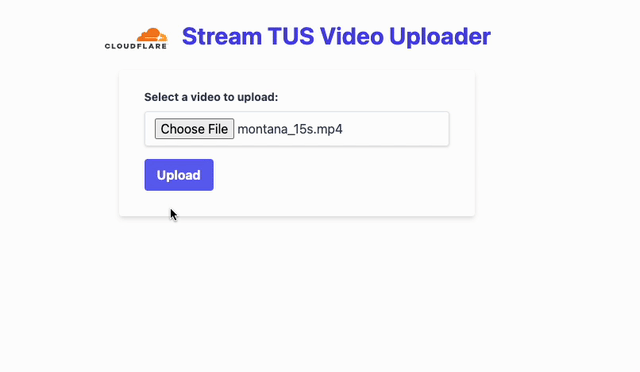

# Cloudflare Stream TUS in PHP

Features an easily deployable PHP server and UI for handling direct creator uploads for Cloudflare Stream.



## Running

First, create a `.env` file with the following details at the root of the directory:

```
CLOUDFLARE_ACCOUNT_ID=your_account_id
CLOUDFLARE_API_TOKEN=your_api_token
```

`make run-dev` to run the server

_Hot reloading support is enabled. If you make changes to the code, the server and client will automatically reload those changes_


## Access

- UI: `http://localhost:3000`
- Upload endpoint: `http://localhost:3000/upload`
- BrowserSync (used for hot reloading): `http://localhost:3001`